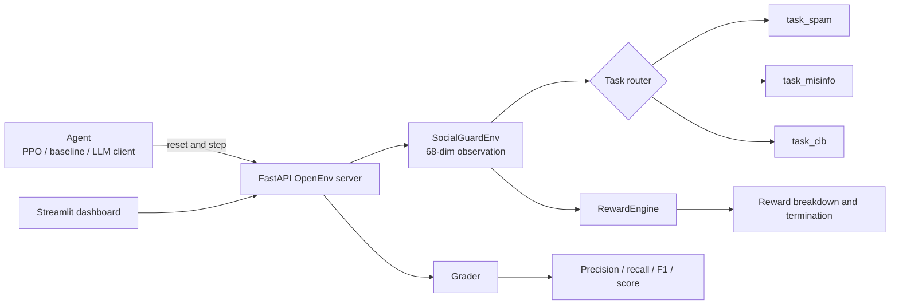

# SocialGuard-RL

> **A reproducible reinforcement-learning environment for social-media integrity moderation.**

[](https://www.python.org/)
[](LICENSE)
[](openenv.yaml)
[](https://fastapi.tiangolo.com/)
[](https://gymnasium.farama.org/)

SocialGuard-RL provides synthetic, seeded environments for training and evaluating moderation policies as **sequential decision-makers**. Instead of treating each account or post as an isolated classification example, an agent observes a fixed-size state, chooses one of five moderation actions, receives a reward breakdown, and continues until the episode terminates or is truncated. The repository exposes the environment through both a Gymnasium-compatible Python interface and an OpenEnv-style FastAPI server.

This project is intended for research, benchmarking, and responsible experimentation with synthetic data. It is **not** a production moderation system and does not make decisions about real users or real social-media content.

## Contents

- [Why SocialGuard-RL](#why-socialguard-rl)
- [Capabilities](#capabilities)
- [Task tracks](#task-tracks)
- [Environment contract](#environment-contract)
- [Architecture](#architecture)
- [Repository layout](#repository-layout)
- [Quick start](#quick-start)
- [Run the API](#run-the-api)
- [Use the environment in Python](#use-the-environment-in-python)
- [Train with PPO](#train-with-ppo)
- [Evaluate a baseline](#evaluate-a-baseline)
- [Configuration](#configuration)
- [Dashboard](#dashboard)
- [Project video](#project-video)
- [Testing and validation](#testing-and-validation)
- [Security and responsible use](#security-and-responsible-use)
- [Contributing](#contributing)
- [License](#license)

## Why SocialGuard-RL

Moderation policies often have to trade off intervention accuracy, response speed, false-positive cost, collateral damage, and escalation to human review. SocialGuard-RL makes those trade-offs explicit in a controlled environment. The same five-action interface is shared across three tasks so that a policy can be compared across local account signals, spreading content, and graph-level coordination.

The environment is designed to make experiments inspectable. Episodes are seedable, task configuration is stored in YAML, per-step responses include structured information, and grading reports precision, recall, F1, reward, episode length, detection time, and collateral impact.

## Capabilities

| Capability | Implementation | Evidence in repository |
|---|---|---|
| Reinforcement-learning environment | Gymnasium-compatible `SocialGuardEnv` | `env/env.py` |
| HTTP serving | FastAPI application with OpenEnv-style endpoints | `server/app.py` |
| Five-action moderation policy | `allow`, `warn`, `reduce_reach`, `remove`, `escalate` | `env/env.py`, `env/spaces.py` |
| Synthetic social graphs | NetworkX graph generation and diffusion | `sim/`, `data/`, `tasks/` |
| Reward accounting | Correctness, false-positive cost, collateral, speed, escalation | `env/rewards.py`, `configs/` |
| Baseline grading | Deterministic rule-based `BaselineAgent` | `baseline.py`, `graders/grader.py` |
| PPO training | Stable-Baselines3 PPO pipeline with optional curriculum | `training/train_ppo.py` |
| Experiment dashboard | Streamlit dashboard and graph views | `dashboard/` |
| Container deployment | Non-root Python 3.12 image on port `7860` | `Dockerfile` |

## Task tracks

Each task uses its own YAML configuration and is routed by the server through `TASK_CONFIG_MAP` in `server/app.py`.

| Task | Difficulty | Scenario | Primary evaluation signal |
|---|---:|---|---|
| `task_spam` | Easy | Classify synthetic accounts from an eight-feature fingerprint. | `0.7 × F1 + 0.3 × sigmoid(mean_reward / 50)` |
| `task_misinfo` | Medium | Follow misinformation as it diffuses through a social graph and decide when to intervene. | `0.6 × F1 + 0.4 × max(0, 1 − mean_hop / max_hops)` |
| `task_cib` | Hard | Identify a hidden coordinated inauthentic behavior cluster while limiting collateral damage. | `0.5 × recall + 0.5 × F1 − min(collateral_rate × 2, 0.5)` |

The tasks are synthetic and configurable. The `task_cib` environment supports spectral embeddings by default and includes an optional node2vec path with a cache directory controlled by `SOCIALGUARD_NODE2VEC_CACHE_DIR`.

## Environment contract

### Observation space

The environment exposes a fixed `Box(float32, shape=(68,))` observation vector. Shorter task-specific feature sets are zero-padded so that a policy can use one stable input shape across all tracks.

| Task | Active feature range | Example signals |
|---|---:|---|
| Spam | `0–7` | Account age, posting rate, follower ratio, login-time variance, repetition, profile completeness, device uniqueness, and IP diversity. |
| Misinformation | `0–5` | Spread rate, fact-check flag, engagement ratio, source credibility, hop count, and normalized timestep. |
| CIB | `0–67` | A 64-dimensional graph embedding plus centrality, clustering, community, and normalized posting-rate features. |

### Action space

`Discrete(5)` is shared across all tasks.

| ID | Action | Meaning |
|---:|---|---|
| `0` | `allow` | Take no moderation action. |
| `1` | `warn` | Add a warning intervention. |
| `2` | `reduce_reach` | Limit distribution without removing the item or account. |
| `3` | `remove` | Remove the item or account from the simulated surface. |
| `4` | `escalate` | Send the case for human review when the task supports escalation. |

### Reward model

The reward engine is configured in YAML and reports a structured breakdown in the step `info` payload:

```text
R = α · correctness
  − β · false_positive_cost
  − γ · collateral_damage
  + δ · speed_bonus
  − ε · escalation_penalty
```

The exact coefficient values and task-specific overrides live in `configs/default.yaml`, `configs/task1.yaml`, `configs/task2.yaml`, and `configs/task3.yaml`.

## Architecture



The HTTP service initializes one environment and lock per task. `POST /reset` starts an episode, `POST /step` advances it, and `GET /grade/{task_name}` runs the isolated rule-based baseline grader for a selected task. When `SOCIALGUARD_API_TOKEN` is set, protected endpoints require an `Authorization: Bearer <token>` header; metadata endpoints such as `/healthz` remain public.

## Repository layout

```text
SocialGuard-RL/
├── env/                 # Core Gymnasium environment, models, spaces, rewards
├── tasks/               # Spam, misinformation, and CIB task implementations
├── sim/                 # Synthetic content, graph, and user-behavior generators
├── data/                # Synthetic graph utilities
├── graders/             # Evaluation metrics and normalized scores
├── training/            # PPO training, curriculum, and callbacks
├── dashboard/           # Streamlit dashboard and graph/metrics views
├── configs/             # Default and per-task YAML configuration
├── tests/               # Pytest suite
├── video/               # Editable HyperFrames composition and rendered overview
├── server/app.py        # FastAPI application
├── baseline.py          # Deterministic rule-based baseline agent
├── inference.py         # OpenAI-compatible model client example
├── Dockerfile           # Production container definition
├── openenv.yaml         # OpenEnv metadata registry
└── pyproject.toml       # Package metadata and server entry point
```

## Quick start

### Prerequisites

Use Python `3.10` or newer. Python `3.12` is the version used by the repository Docker image. Docker is optional for local development; a local installation needs the packages listed in `requirements.txt`.

### Install locally

```bash
git clone https://github.com/vincenzo-afk/SocialGuard-RL.git
cd SocialGuard-RL
python3 -m venv .venv
source .venv/bin/activate
python -m pip install --upgrade pip
python -m pip install -r requirements.txt
```

### Start the server

```bash
uvicorn server.app:app --host 0.0.0.0 --port 7860
```

Open the interactive API documentation at [http://localhost:7860/docs](http://localhost:7860/docs) after the server starts.

### Run with Docker

```bash
docker build -t socialguard-rl .
docker run --rm -p 7860:7860 socialguard-rl
```

Optional model-client settings can be passed at runtime when using `inference.py`:

```bash
docker run --rm -p 7860:7860 \
  -e API_BASE_URL="https://api-inference.huggingface.co/v1" \
  -e MODEL_NAME="meta-llama/Llama-4-Maverick-17B-128E-Instruct" \
  -e HF_TOKEN="hf_your_token_here" \
  socialguard-rl
```

## Run the API

The following commands assume the server is running on `localhost:7860`.

```bash
# Start a seeded spam episode.
curl -s -X POST http://localhost:7860/reset \
  -H "Content-Type: application/json" \
  -d '{"task":"task_spam","seed":42}' | python3 -m json.tool

# Take action 3 (remove) in the active spam episode.
curl -s -X POST http://localhost:7860/step \
  -H "Content-Type: application/json" \
  -d '{"task":"task_spam","action":3}' | python3 -m json.tool

# Inspect the active task state.
curl -s "http://localhost:7860/state?task=task_spam" | python3 -m json.tool

# Read the task configuration.
curl -s http://localhost:7860/config/task_cib | python3 -m json.tool

# Run the baseline grader for one task or all tasks.
curl -s "http://localhost:7860/grade/task_cib?n_episodes=10&seed=42" | python3 -m json.tool
curl -s "http://localhost:7860/grade/all?n_episodes=10&seed=42" | python3 -m json.tool

# Check service health and Prometheus-style metrics.
curl -s http://localhost:7860/healthz | python3 -m json.tool
curl -s http://localhost:7860/metrics
```

The `/step` response includes the next observation, scalar reward, `terminated`, `truncated`, and an `info` object containing task-specific signals and reward details. Call `/reset` before calling `/step` for a task.

## Use the environment in Python

```python
from env.env import SocialGuardEnv

env = SocialGuardEnv("configs/task1.yaml", seed=42)
observation, info = env.reset(seed=42)

for _ in range(10):
    action = 0
    observation, reward, terminated, truncated, info = env.step(action)
    if terminated or truncated:
        break

env.close()
```

## Train with PPO

The training entry point loads `configs/default.yaml`, optionally merges a task-specific YAML file, writes the merged configuration into the run directory, evaluates during training, and saves the final model as `final_model.zip`.

```bash
# Default configuration.
python training/train_ppo.py \
  --config configs/default.yaml \
  --run_name ppo_default

# Task-specific spam training with four environments.
python training/train_ppo.py \
  --config configs/default.yaml \
  --task_config configs/task1.yaml \
  --run_name ppo_spam \
  --n_envs 4

# Task 3 curriculum training. The trainer forces one environment for task_cib.
python training/train_ppo.py \
  --config configs/default.yaml \
  --task_config configs/task3.yaml \
  --run_name ppo_cib \
  --curriculum
```

Useful flags include `--output_dir`, `--device`, `--n_envs`, and `--curriculum`. Generated model artifacts are written below `models/`, which is ignored by Git.

## Evaluate a baseline

The server’s grading routes run the deterministic `BaselineAgent` in an isolated worker process. The grader reports precision, recall, F1, mean reward, mean episode length, time to detection, mean collateral, and a normalized score for each task. Use the API examples above for a repeatable seeded evaluation.

The scoring implementation is in `graders/grader.py`, while the public route and score-formula map are in `server/app.py`.

## Configuration

Configuration is organized by concern:

| File | Purpose |
|---|---|
| `configs/default.yaml` | Shared environment, reward, graph, and training defaults. |
| `configs/task1.yaml` | Spam-account task overrides. |
| `configs/task2.yaml` | Misinformation-diffusion task overrides. |
| `configs/task3.yaml` | CIB graph task overrides. |
| `configs/inference.yaml` | Model-client inference settings. |
| `openenv.yaml` | Service metadata, routes, and task registry. |

For deployments that need request authentication, set `SOCIALGUARD_API_TOKEN` in the process environment. Do not commit `.env` files or real credentials; `.env.example` documents the expected local pattern.

## Dashboard

The repository includes a Streamlit dashboard for metrics, learning curves, and graph views. Start it from the repository root:

```bash
streamlit run dashboard/app.py
```

The dashboard is a local research interface. It should not be treated as an authorization layer or as a replacement for independent evaluation.

## Project video

The repository includes a **26-second editable HTML overview video** and a rendered MP4 preview. The composition is self-contained, uses a deterministic GSAP timeline, and is built around the actual SocialGuard-RL task tracks and API contract.

<video controls muted playsinline width="100%" poster="https://raw.githubusercontent.com/vincenzo-afk/SocialGuard-RL/main/learning_curve.png">
  <source src="./video/socialguard-rl-overview.mp4" type="video/mp4" />
  Your browser does not support embedded video. [Download the MP4 preview](./video/socialguard-rl-overview.mp4).
</video>

If the GitHub renderer does not play the inline preview, use these repository files directly:

- [Editable HTML composition](video/index.html)
- [Motion-intent assertions](video/index.motion.json)
- [Rendered MP4 preview](video/socialguard-rl-overview.mp4)
- [Video workspace manifest](video/package.json)

To validate or re-render the composition locally, install Node.js 22 or newer and run:

```bash
cd video
npm install
npm run check
npm run render
```

## Testing and validation

Run the Python test suite from the repository root:

```bash
pytest
```

The repository also includes a pre-validation script for environments that provide Docker, `curl`, Python, and `jq`:

```bash
bash scripts/pre_validate.sh
```

The HTML video has an independent validation gate:

```bash
cd video
npm run check
```

The checked composition passes HyperFrames lint, runtime, layout, motion, and contrast validation. The rendered MP4 is 26.0 seconds and is stored at `video/socialguard-rl-overview.mp4`.

## Security and responsible use

SocialGuard-RL generates synthetic scenarios for experimentation. Do not connect it to real moderation queues, real user records, or production enforcement systems without an independent safety, privacy, security, and policy review.

Keep API tokens in environment variables or a secret manager. The server supports optional bearer-token protection through `SOCIALGUARD_API_TOKEN`; never place tokens in YAML committed to the repository, shell scripts, README examples, or issue reports. Security issues should be reported privately to the repository owner through GitHub rather than disclosed in a public issue.

## Contributing

Contributions should preserve deterministic seeds, update the relevant YAML configuration or tests, and document any changed API or score behavior. Before opening a pull request, run the relevant pytest tests and ensure that README commands match the current implementation. Keep generated model checkpoints, caches, credentials, and local video dependencies out of commits.

## License

SocialGuard-RL is released under the [MIT License](LICENSE). The project’s copyright notice is maintained in the root `LICENSE` file.

## References

1. [Gymnasium documentation](https://gymnasium.farama.org/) — environment API and spaces.
2. [FastAPI documentation](https://fastapi.tiangolo.com/) — HTTP API framework used by `server/app.py`.
3. [Stable-Baselines3 documentation](https://stable-baselines3.readthedocs.io/) — PPO training implementation used by `training/train_ppo.py`.
4. [NetworkX documentation](https://networkx.org/documentation/stable/) — graph construction and analysis utilities.
5. [OpenEnv repository](https://github.com/meta-pytorch/OpenEnv) — OpenEnv ecosystem reference.
6. [GitHub repository topics guidance](https://docs.github.com/en/repositories/managing-your-repositorys-settings-and-features/customizing-your-repository/classifying-your-repository-with-topics) — topic naming and limits.
